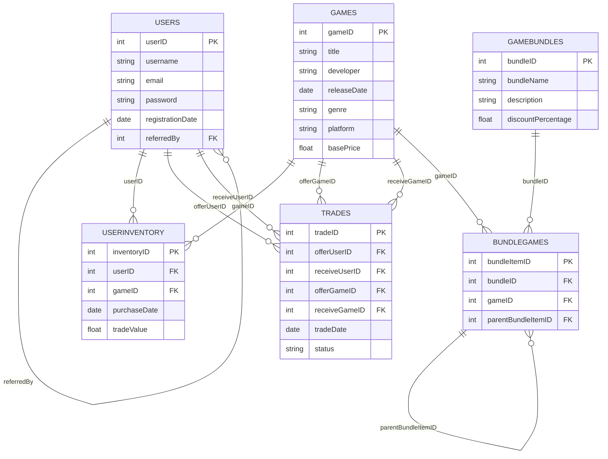

# Video game trading-store database

## Purpose of the database

The database is designed to store information about users, games, user inventories, trades, game bundles, and the games that are part of the bundles. The database is used by a video game trading-store where users can trade games with each other and buy game bundles at a discounted price. The database will help the store keep track of users, games, trades, and game bundles. It will also help in managing the inventory of games and tracking the trades between users.

## Schema

The database schema is as follows:

Users Table:

- userID (Primary Key)
- username
- email
- password (hashed)
- registrationDate
- referredBy (Foreign Key to userID)

Games Table:

- gameID (Primary Key)
- title
- developer
- releaseDate
- genre
- platform
- basePrice

UserInventory Table:

- inventoryID (Primary Key)
- userID (Foreign Key to Users)
- gameID (Foreign Key to Games)
- purchaseDate
- tradeValue
  
Trades Table:

- tradeID (Primary Key)
- offerUserID (Foreign Key to Users)
- receiveUserID (Foreign Key to Users)
- offerGameID (Foreign Key to Games)
- receiveGameID (Foreign Key to Games)
- tradeDate
- status (Pending, Accepted, Rejected)

GameBundles Table:

- bundleID (Primary Key)
- bundleName
- description
- discountPercentage

BundleGames Table:

- bundleItemID (Primary Key)
- bundleID (Foreign Key to GameBundles)
- gameID (Foreign Key to Games)
- parentBundleItemID (Foreign Key to BundleGames)

## ERD Diagram

