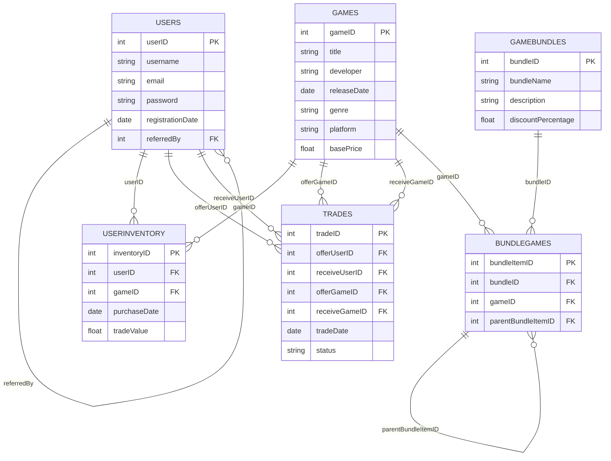

```mermaid
erDiagram
    USERS {
        int userID PK
        string username
        string email
        string password
        date registrationDate
        int referredBy FK
    }

    GAMES {
        int gameID PK
        string title
        string developer
        date releaseDate
        string genre
        string platform
        float basePrice
    }

    USERINVENTORY {
        int inventoryID PK
        int userID FK
        int gameID FK
        date purchaseDate
        float tradeValue
    }

    TRADES {
        int tradeID PK
        int offerUserID FK
        int receiveUserID FK
        int offerGameID FK
        int receiveGameID FK
        date tradeDate
        string status
    }

    GAMEBUNDLES {
        int bundleID PK
        string bundleName
        string description
        float discountPercentage
    }

    BUNDLEGAMES {
        int bundleItemID PK
        int bundleID FK
        int gameID FK
        int parentBundleItemID FK
    }

    USERS ||--o{ USERS : referredBy
    USERS ||--o{ USERINVENTORY : userID
    GAMES ||--o{ USERINVENTORY : gameID
    USERS ||--o{ TRADES : offerUserID
    USERS ||--o{ TRADES : receiveUserID
    GAMES ||--o{ TRADES : offerGameID
    GAMES ||--o{ TRADES : receiveGameID
    GAMEBUNDLES ||--o{ BUNDLEGAMES : bundleID
    GAMES ||--o{ BUNDLEGAMES : gameID
    BUNDLEGAMES ||--o{ BUNDLEGAMES : parentBundleItemID
```
